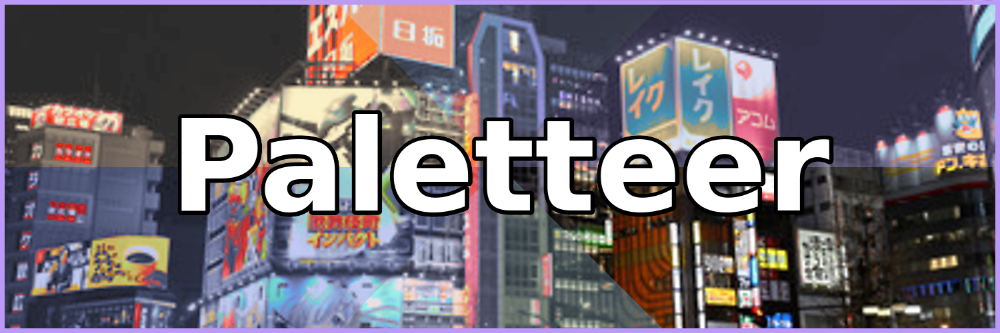

Recolor PNG, JPEG and WEBP wallpapers with built-in or custom color palettes while mapping each image's continuous lightness into the theme's tonal range.

See [PALETTES.md](PALETTES.md) for the supported palette and its colors.

Built-in themes: `everforest-dark-medium`, `catppuccin-mocha`, `tokyo-night`, `gruvbox-dark-medium`, `nord`, `dracula`, and `rose-pine-moon`.

## Examples

Derived previews use `--palette-name-only`; their current settings are defined
in `scripts/regenerate-readme-images.sh` and can be applied with
`make readme-images` without changing these paths.

### Built-in palette comparison

<table>
<tr><th>Original</th><th>Everforest Dark Medium</th></tr>
<tr><td>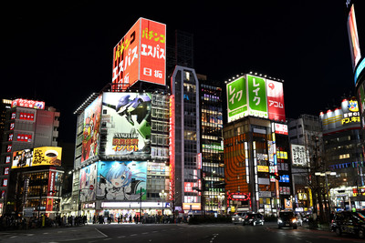</td><td>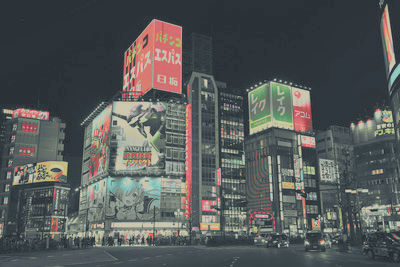</td></tr>
<tr><th>Catppuccin Mocha</th><th>Tokyo Night</th></tr>
<tr><td>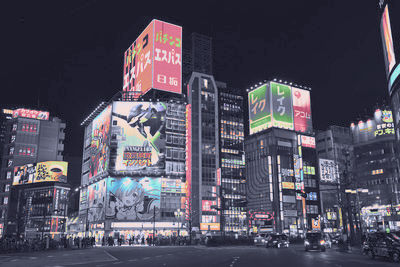</td><td>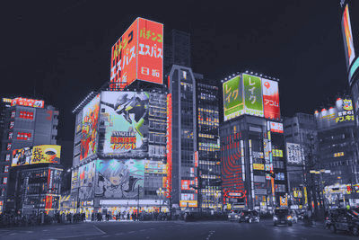</td></tr>
<tr><th>Gruvbox Dark Medium</th><th>Nord</th></tr>
<tr><td>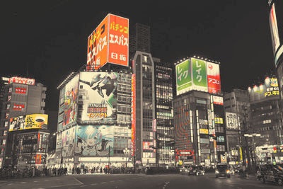</td><td>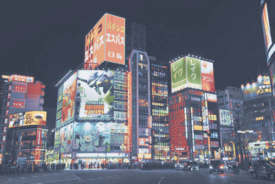</td></tr>
<tr><th>Dracula</th><th>Rosé Pine Moon</th></tr>
<tr><td>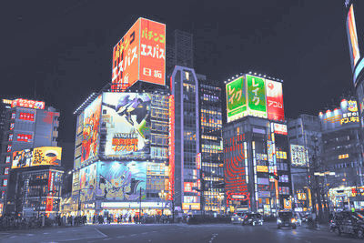</td><td>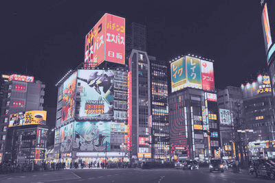</td></tr>
</table>

## Everforest Dark Medium Comparison

<table>
<tr><th>Original</th><th>Everforest Dark Medium</th></tr>
<tr><td>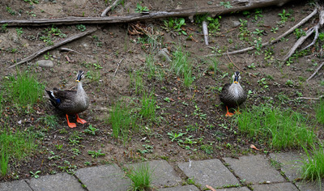</td><td>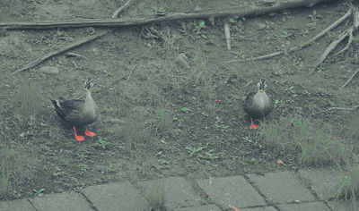</td></tr>
<tr><td>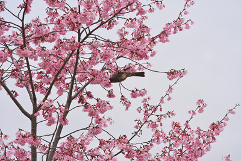</td><td>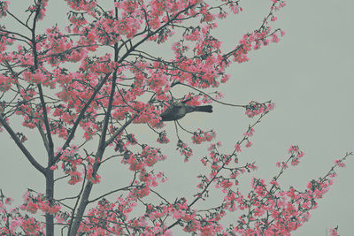</td></tr>
<tr><td>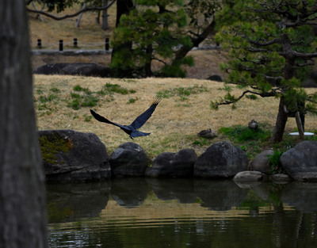</td><td>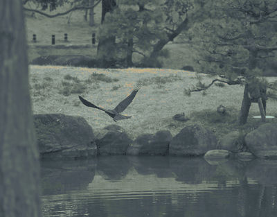</td></tr>
<tr><td>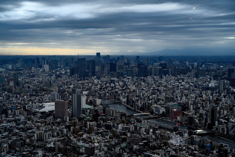</td><td>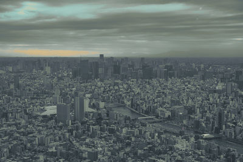</td></tr>
<tr><td>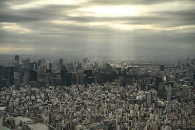</td><td>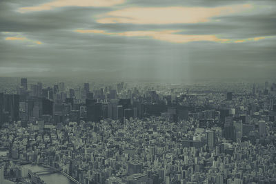</td></tr>
<tr><td></td><td>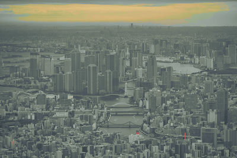</td></tr>
<tr><td></td><td>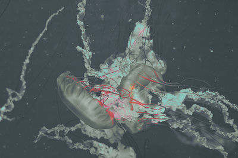</td></tr>
<tr><td>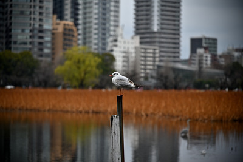</td><td>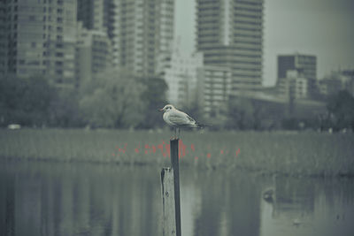</td></tr>
<tr><td></td><td>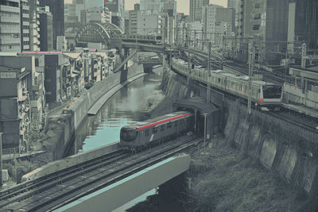</td></tr>
<tr><td>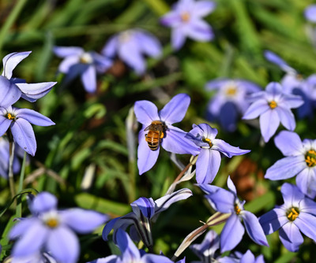</td><td>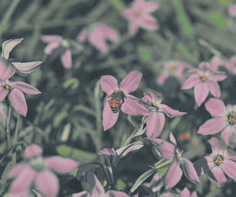</td></tr>
<tr><td></td><td></td></tr>
<tr><td>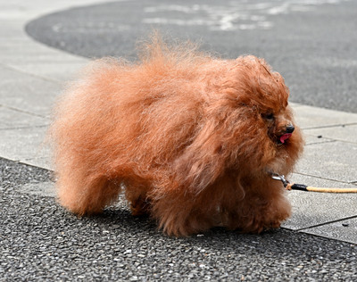</td><td>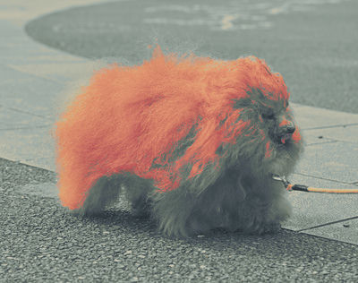</td></tr>
<tr><td></td><td>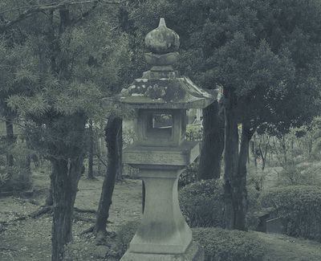</td></tr>
<tr><td></td><td></td></tr>
<tr><td>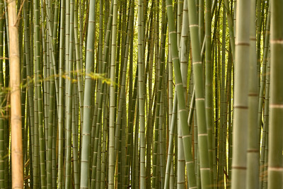</td><td>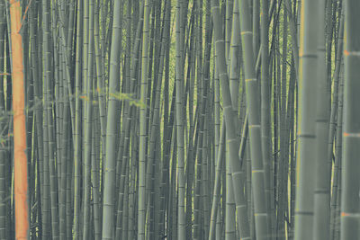</td></tr>
<tr><td>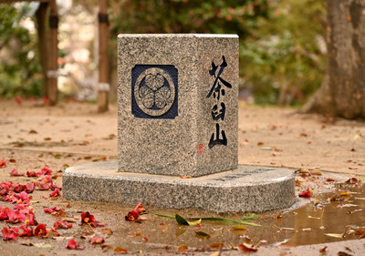</td><td>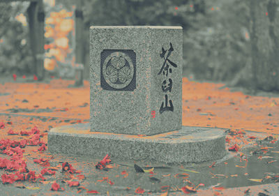</td></tr>
<tr><td></td><td>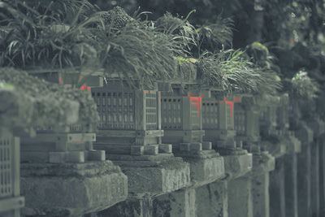</td></tr>
<tr><td>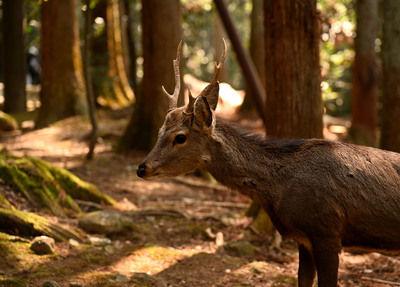</td><td>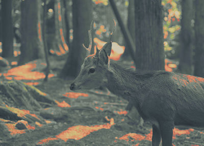</td></tr>
<tr><td></td><td>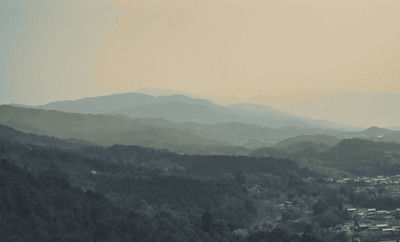</td></tr>
</table>

## Installation

```sh
cargo install --path .
```

## Usage

```text
paletteer [OPTIONS] <--theme <THEME>|--theme-file <FILE>> <INPUT>...
```

| Argument | Required / default | Effect | Use case |
| --- | --- | --- | --- |
| `<INPUT>...` | Required; one or more | Recolors PNG, JPG, JPEG, or WebP files. Accepts individual files, directories, and expanded or quoted globs. Directories include immediate supported files only. | Process one image, batch a folder, or select files recursively with a quoted glob such as `'**/*-forest.jpg'`. |
| `-t`, `--theme <THEME>` | No default; required unless `--theme-file` is used | Selects one of the built-in color palettes. | Use a bundled palette without maintaining a separate file. |
| `--theme-file <FILE>` | No default; required unless `--theme` is used | Loads a custom TOML palette. Cannot be combined with `--theme`. | Recolor with your own base and accent colors. |
| `-n`, `--normalize-name` | Optional; off | Lowercases the generated output stem and restricts it to `a-z`, `0-9`, and `-`. | Produce predictable, shell-friendly filenames from names containing spaces, punctuation, or uppercase characters. |
| `--palette-name-only` | Optional; off | Omits `neutral`, `lambda`, and `mix` settings from the output filename, leaving only the palette suffix. | Keep filenames short when settings are tracked elsewhere. Different settings then resolve to the same output path. |
| `-f`, `--format <FORMAT>` | Optional; `png` | Selects `png`, `webp`, or `jpg` output. PNG is lossless; JPEG discards alpha. | Choose lossless output, smaller WebP files, or broadly compatible JPEG files. |
| `-q`, `--quality <1-100>` | Optional; `80` for WebP/JPEG | Sets lossy encoding quality. Using it with PNG is an error. | Trade output size for visual quality when writing WebP or JPEG. |
| `--neutral-only` | Optional; off | Excludes accent colors and adds `-neutral` to the output filename. | Produce a deliberately subdued, near-monochrome result. |
| `--lambda <0-1>` | Optional; `0.25` | Weights the mapped theme lightness when selecting the nearest palette color. Non-default values add `-lambda-<value>` to the filename. | Use `0` for hue/chroma-only matching or increase toward `1` to make palette lightness influence color assignment. |
| `--mix <0-1>` | Optional; `1` | Blends the original Oklab color with the recolored result, including its theme-mapped lightness. Non-default values add `-mix-<value>` to the output filename. | Use `0` for the original colors, an intermediate value such as `0.5` for a subtler result, or `1` for the full theme tonal range and chroma remap. |
| `-o`, `--overwrite` | Optional; off | Replaces an existing output only after the new image encodes successfully. | Regenerate images without deleting old outputs manually. |
| `-h`, `--help` | Optional | Prints the built-in CLI reference. | Check available arguments from the installed binary. |

## Custom palettes

Pass a TOML file with `--theme-file`:

```toml
name = "forest-dusk"
colors = ["#1b2428", "#556b62", "#d8c9aa"]
accents = ["#e67e80", "#a7c080", "#7fbbb3"]
```

`name` becomes the output filename suffix and must contain only lowercase
letters, digits, and single hyphens. `colors` must contain at least one
`#RRGGBB` color. `accents` is optional and participates by default; use
`--neutral-only` to exclude it.

```sh
paletteer --theme-file examples/forest-dusk.toml --mix 0.9 wallpaper.jpg
```

Quote recursive globs for consistent behavior across shells. Files whose names
already carry a built-in or currently selected custom palette suffix
(optionally followed by `-neutral`, `-lambda-<value>`, and `-mix-<value>`) are
skipped to prevent repeat recoloring.

## Acknoledgements

This project was developed with assistance from AI coding tools. The resulting code was reviewed and tested by the maintainer.
