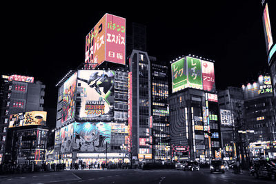
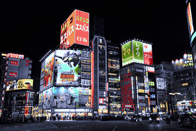
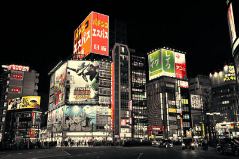
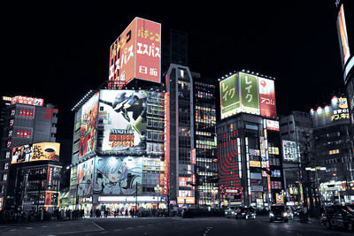
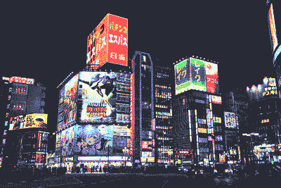
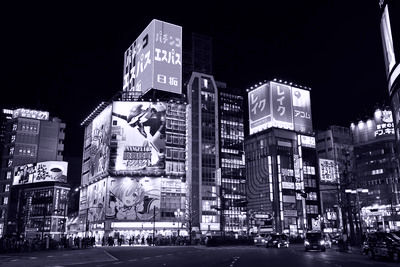

# Paletteer


Recolor PNG, JPEG and WEBP wallpapers with built-in or custom color palettes while preserving each pixel's source lightness.

See [PALETTES.md](PALETTES.md) for the supported palette and its colors.

Built-in themes: `everforest-dark-medium`, `catppuccin-mocha`, `tokyo-night`, `gruvbox-dark-medium`, `nord`, `dracula`, and `rose-pine-moon`.

## Examples

<table>
<tr><th>Original</th><th>Everforest Dark Medium</th><th>Everforest Dark Medium (accents)</th></tr>
<tr><td></td><td></td><td></td></tr>
<tr><td></td><td></td><td></td></tr>
<tr><td></td><td></td><td></td></tr>
<tr><td></td><td></td><td></td></tr>
<tr><td></td><td></td><td></td></tr>
<tr><td></td><td></td><td></td></tr>
<tr><td></td><td></td><td></td></tr>
<tr><td></td><td></td><td></td></tr>
<tr><td></td><td></td><td></td></tr>
<tr><td></td><td></td><td></td></tr>
<tr><td></td><td></td><td></td></tr>
<tr><td></td><td></td><td></td></tr>
<tr><td></td><td></td><td></td></tr>
<tr><td></td><td></td><td></td></tr>
<tr><td></td><td></td><td></td></tr>
<tr><td></td><td></td><td></td></tr>
<tr><td></td><td></td><td></td></tr>
<tr><td></td><td></td><td></td></tr>
<tr><td></td><td></td><td></td></tr>
</table>

### Built-in palette comparison

<table>
<tr><th>Original</th><th>Everforest Dark Medium</th></tr>
<tr><td></td><td></td></tr>
<tr><th>Catppuccin Mocha</th><th>Tokyo Night</th></tr>
<tr><td></td><td></td></tr>
<tr><th>Gruvbox Dark Medium</th><th>Nord</th></tr>
<tr><td></td><td></td></tr>
<tr><th>Dracula</th><th>Rosé Pine Moon</th></tr>
<tr><td></td><td></td></tr>
</table>

## Installation

```sh
cargo install --path .
```

## Usage

```text
paletteer [OPTIONS] --theme <THEME> <INPUT>...
```

| Argument | Required / default | Effect | Use case |
| --- | --- | --- | --- |
| `<INPUT>...` | Required; one or more | Recolors PNG, JPG, JPEG, or WebP files. Accepts individual files, directories, and expanded or quoted globs. Directories include immediate supported files only. | Process one image, batch a folder, or select files recursively with a quoted glob such as `'**/*-forest.jpg'`. |
| `-t`, `--theme <THEME>` | Required; currently `everforest-dark-medium` | Selects the target color palette. | Choose the palette applied to every input. |
| `-n`, `--normalize-name` | Optional; off | Lowercases the generated output stem and restricts it to `a-z`, `0-9`, and `-`. | Produce predictable, shell-friendly filenames from names containing spaces, punctuation, or uppercase characters. |
| `-f`, `--format <FORMAT>` | Optional; `png` | Selects `png`, `webp`, or `jpg` output. PNG is lossless; JPEG discards alpha. | Choose lossless output, smaller WebP files, or broadly compatible JPEG files. |
| `-q`, `--quality <1-100>` | Optional; `80` for WebP/JPEG | Sets lossy encoding quality. Using it with PNG is an error. | Trade output size for visual quality when writing WebP or JPEG. |
| `-a`, `--accents` | Optional; off | Includes Everforest accent colors and adds `-accent` to the output filename. | Retain more colorful reds, oranges, yellows, greens, blues, and purples. |
| `--mix <0-1>` | Optional; `1` | Blends the original and remapped Oklab color while preserving source lightness. Non-default values add `-mix-<value>` to the output filename. | Use `0` for the original colors, an intermediate value such as `0.5` for a subtler palette tint, or `1` for the full remap. |
| `-o`, `--overwrite` | Optional; off | Replaces an existing output only after the new image encodes successfully. | Regenerate images without deleting old outputs manually. |
| `-h`, `--help` | Optional | Prints the built-in CLI reference. | Check available arguments from the installed binary. |

Quote recursive globs for consistent behavior across shells. Files whose names
already end in `-everforest-dark-medium` or
`-everforest-dark-medium-accent` (optionally followed by `-mix-<value>`) are
skipped to prevent repeat recoloring.
