# paletteer

Recolor PNG and JPEG wallpapers with the built-in `everforest-dark-medium` palette while preserving each pixel's source lightness. Outputs are written beside their inputs and never overwrite an existing file.

See [PALETTES.md](PALETTES.md) for the supported palette and its colors.

## Examples

<table>
<tr><th>Original</th><th>Everforest Dark Medium</th><th>Everforest Dark Medium (accents)</th></tr>
<tr><td></td><td>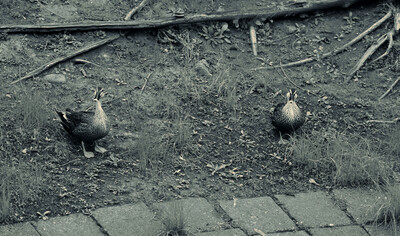</td><td>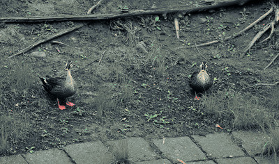</td></tr>
<tr><td></td><td>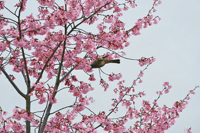</td><td>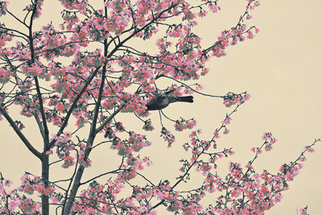</td></tr>
<tr><td></td><td>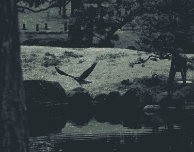</td><td>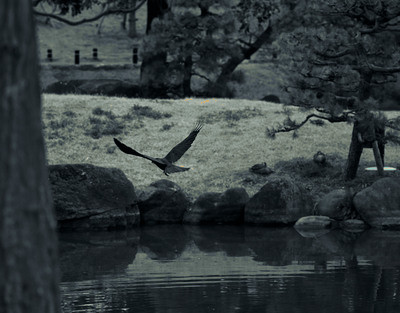</td></tr>
<tr><td></td><td>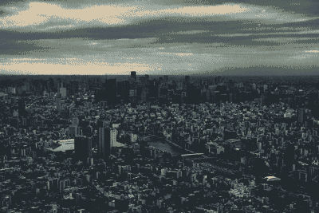</td><td>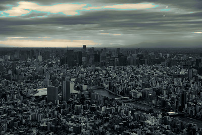</td></tr>
<tr><td></td><td>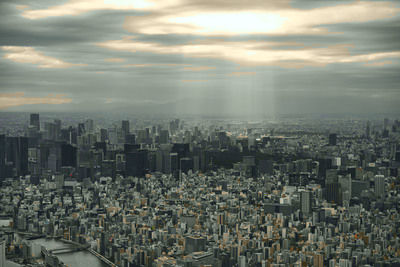</td><td></td></tr>
<tr><td>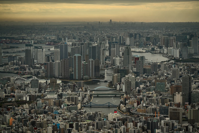</td><td>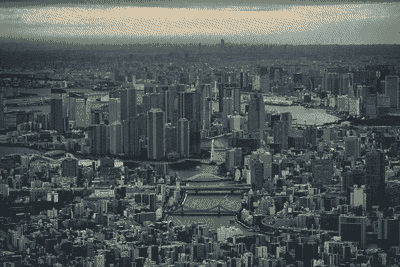</td><td>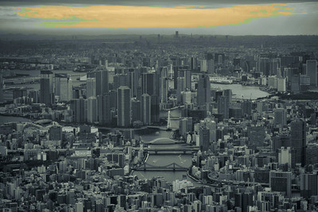</td></tr>
<tr><td>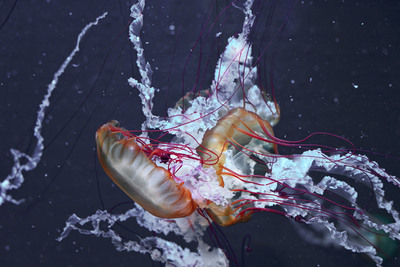</td><td>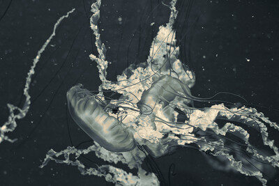</td><td>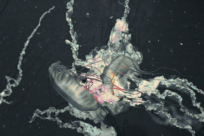</td></tr>
<tr><td></td><td>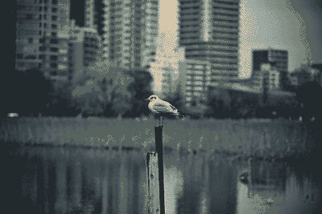</td><td></td></tr>
<tr><td>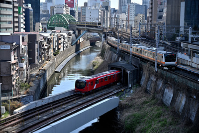</td><td>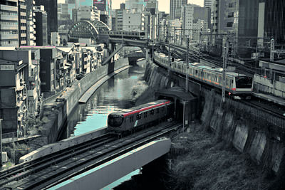</td><td>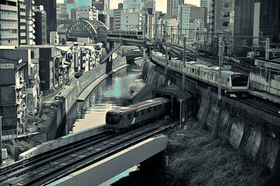</td></tr>
<tr><td></td><td>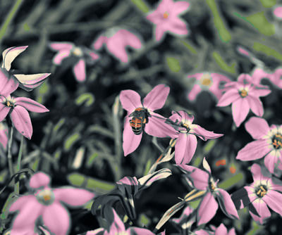</td><td>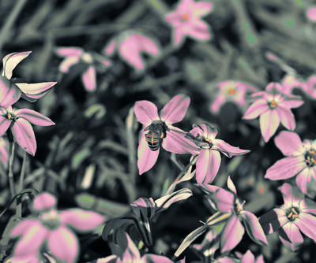</td></tr>
<tr><td></td><td>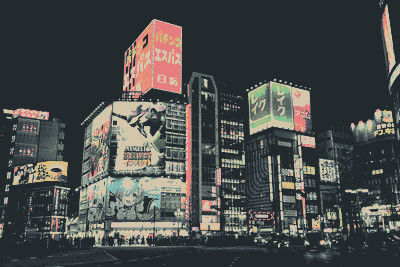</td><td>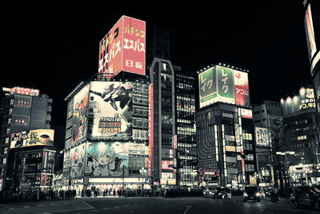</td></tr>
<tr><td></td><td>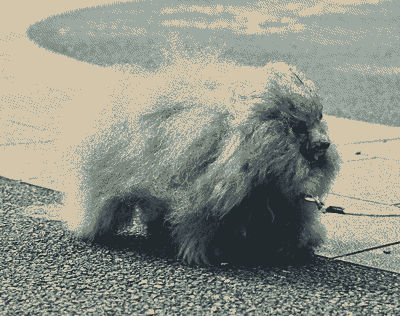</td><td>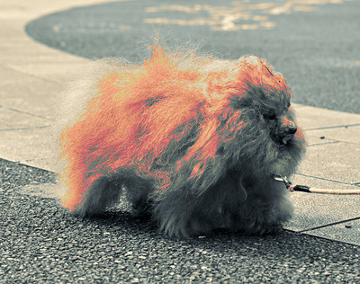</td></tr>
<tr><td>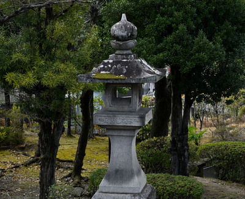</td><td>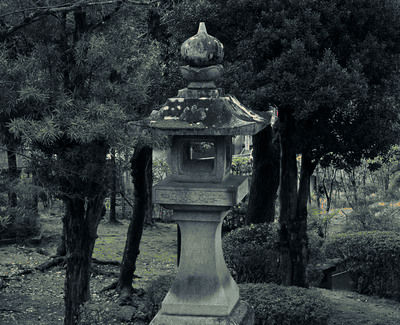</td><td>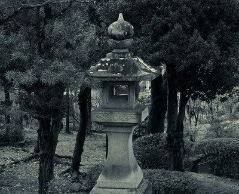</td></tr>
<tr><td></td><td></td><td></td></tr>
<tr><td></td><td>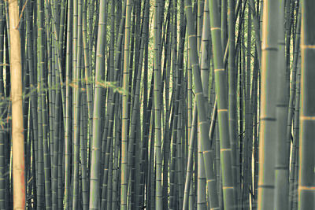</td><td>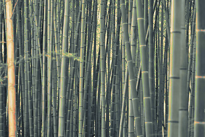</td></tr>
<tr><td></td><td>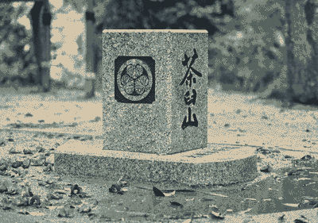</td><td>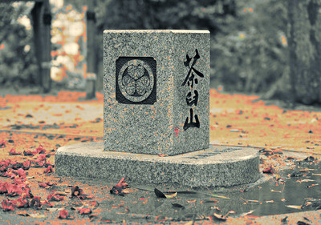</td></tr>
<tr><td>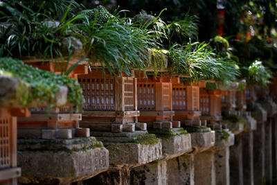</td><td>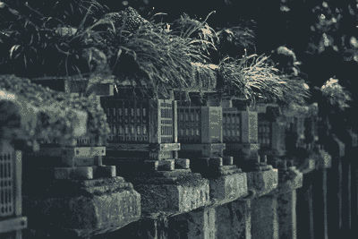</td><td>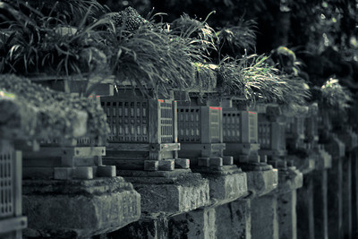</td></tr>
<tr><td></td><td>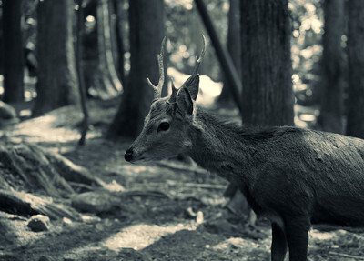</td><td>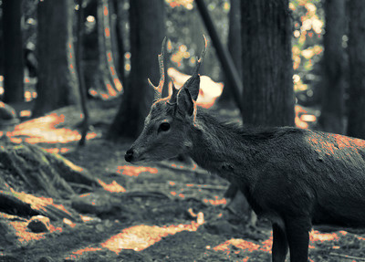</td></tr>
<tr><td>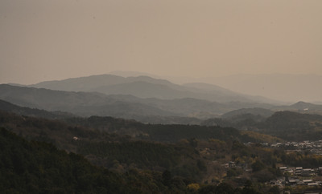</td><td>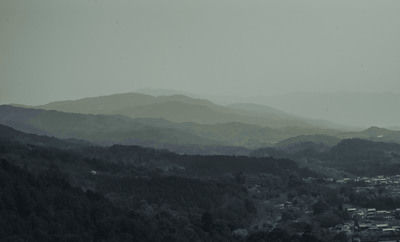</td><td>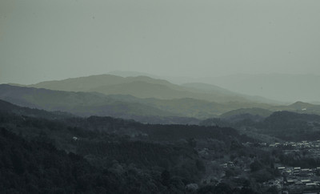</td></tr>
</table>

```sh
cargo install --path .
paletteer -t everforest-dark-medium wallpaper.jpg
paletteer -t everforest-dark-medium -f webp -q 85 wallpaper.jpg
paletteer -t everforest-dark-medium -f jpg -q 90 wallpaper.png
paletteer -t everforest-dark-medium --accents wallpaper.jpg
paletteer -t everforest-dark-medium --overwrite wallpaper.jpg
paletteer -t everforest-dark-medium images/
paletteer -t everforest-dark-medium -n 'wallpapers/**/*-forest.{png,jpg,jpeg}'
```

Directories include immediate PNG, JPG, and JPEG files only. Quote recursive globs for consistent shell behavior; unquoted globs work when the shell expands them.

`--format` / `-f` accepts `png` (the lossless default), `webp`, or `jpg`. `--quality` / `-q` accepts 1–100 for WebP and JPEG (default 80); PNG rejects it. JPEG does not support alpha, so it discards it.

Accent colors are disabled by default to avoid shifting natural highlights to unrelated hues. Use `--accents` / `-a` to include them.
Accent-enabled outputs add `-accent` to their filename.

Existing outputs are rejected by default. Use `--overwrite` / `-o` to replace them after successful encoding.

Files whose names already end in `-everforest-dark-medium` are skipped, preventing accidental repeat recoloring when processing directories or globs.
